# Scene Composer
### Cinematic Composition Generator for Blender

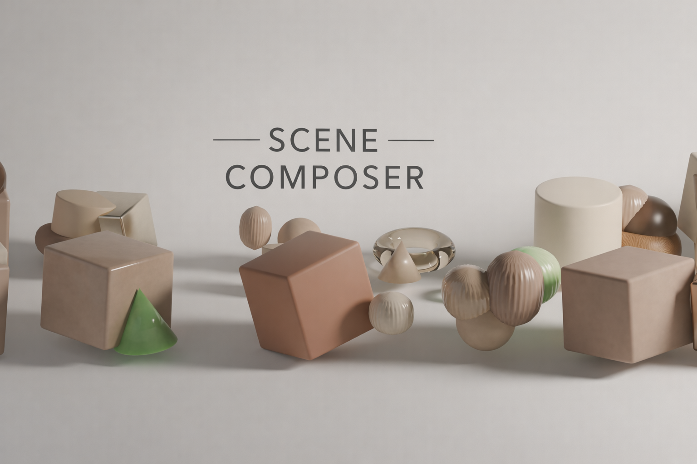

---

Skip the setup and dive straight into creation. **Scene Composer** is a free Blender Addon that generates professional, randomized environments with a single click. Use it as a high-quality foundation, then refine, swap, or remove elements directly in Blender to perfect your vision. It's the ultimate shortcut to professional compositions.

---

## Features

- **Cinematic Lighting** — Professional-grade illumination and shadow rendering.
- **Configurable Object Distribution** — Precise control over object density and placement.
- **Advanced Composition** — Layout modes guided by fundamental design principles (Contrast, Linearity, etc.).
- **Comprehensive Material Presets** — Ready-to-use shaders for hard surfaces (metal, plastic), fabrics, and subsurface scattering (skin, jade).
- **Instant Mood Setting** — Choose from a library of professionally balanced palettes to instantly shift the tone and emotion of your composition.

---

## Installation

**For Blender 5.0 (v1.0)**

1. Download: [scene_composer_blender50.zip](scene_composer_blender50.zip)
2. **License:** GPL, Free
3. In Blender 5.0 — Install via `Edit → Preferences → Add-ons → Install from Disk`
4. Select the file `scene_composer_blender50.zip`
5. After installing, press **N** in the 3D Viewport to open the sidebar and find the **Primitives** tab.
6. **Usage:** Click the **Generate** button. Pick and prune generated assets. Click the **Render** button.

> Also available for Blender 4.2: [scene_composer_blender42.zip](scene_composer_blender42.zip)

---

## Interface

All parameters are docked directly in the 3D Viewport sidebar, keeping your creative tools exactly where you work. The **Primitives** tab appears after clicking **N** in the 3D Viewport.

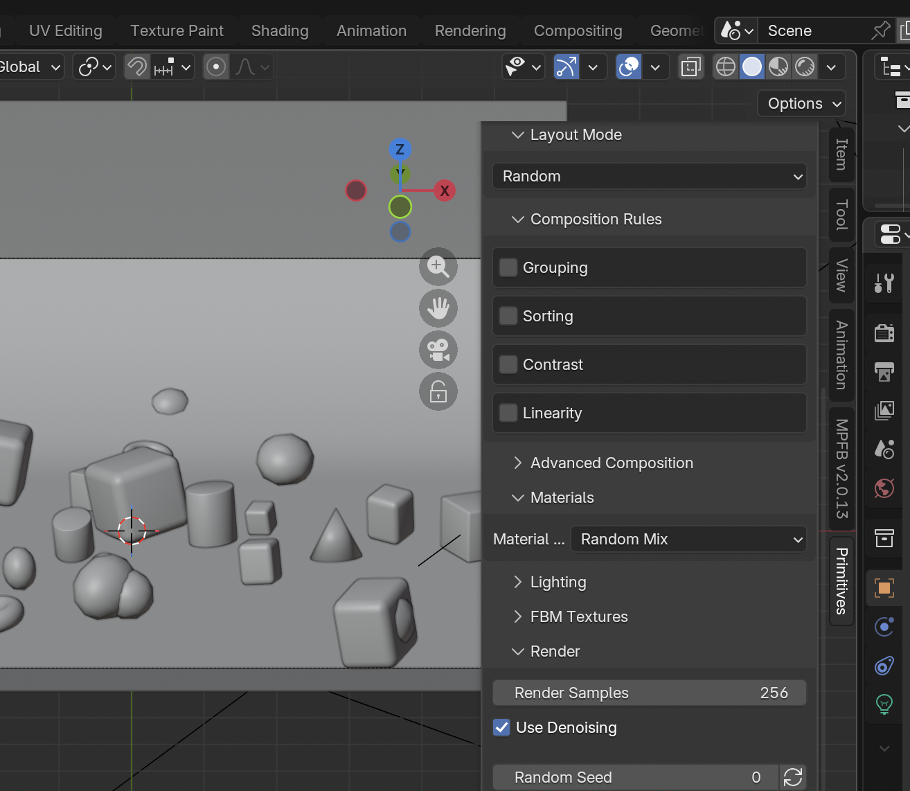

---

## Watch It in Action

See how a single click transforms a blank viewport into a gallery-ready render.

In the 3D Viewport, press the **N** key on your keyboard. This toggles a hidden panel on the far right side of the screen. Look for the tab labeled **"Primitive"**. Clicking this tab will expand the specific interface for the addon, revealing its unique tools and settings.

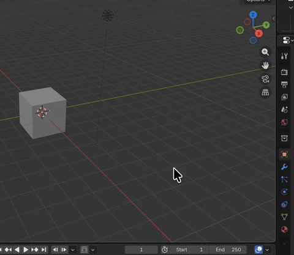

---

## Gallery

### Warm Palette
Balanced shadows and subtle materials for commercial-style stills.

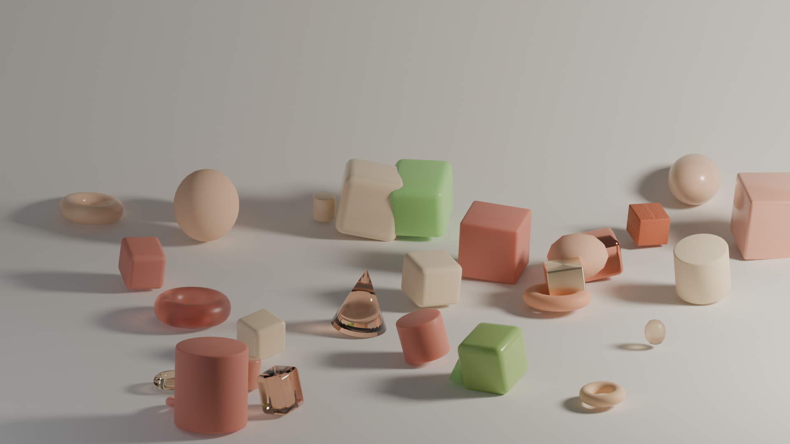

---

### Rose + Metal Mix
Glossy highlights and material contrast for depth.

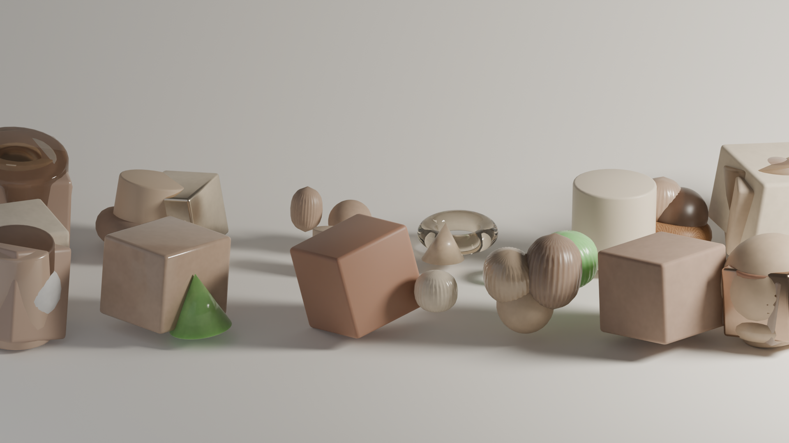

---

### Neutral Study
Neutral materials and directional lighting for long shadows.

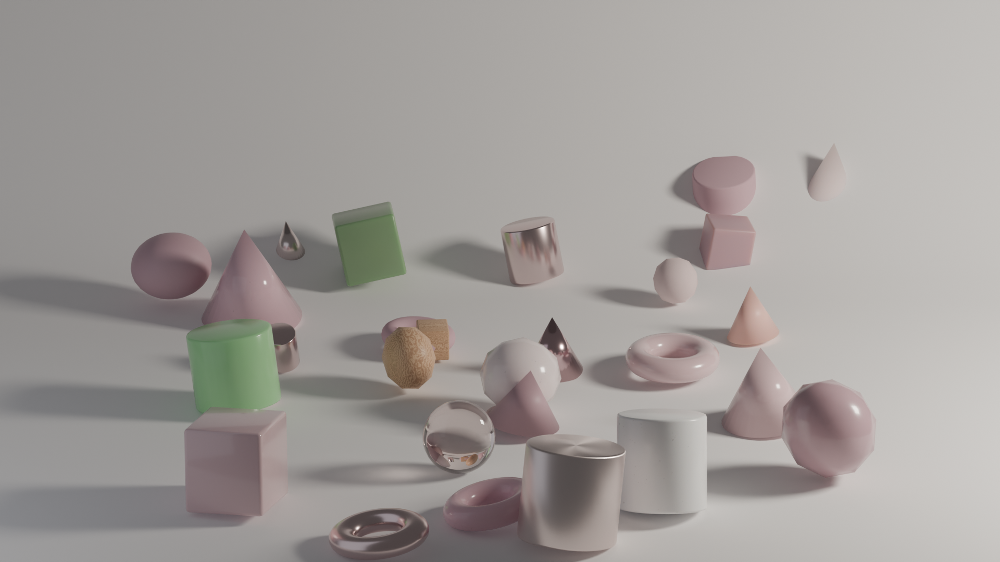

---

### Cool Tones
Soft gradients and cinematic contrast.

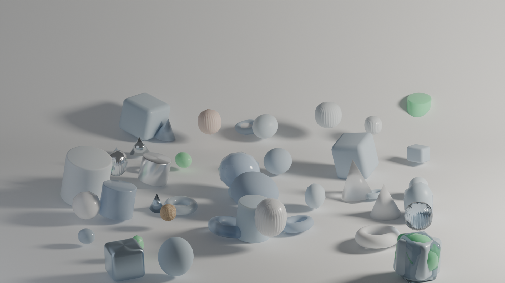

---

### Minimal Layout
Rule-based placement with careful negative space.

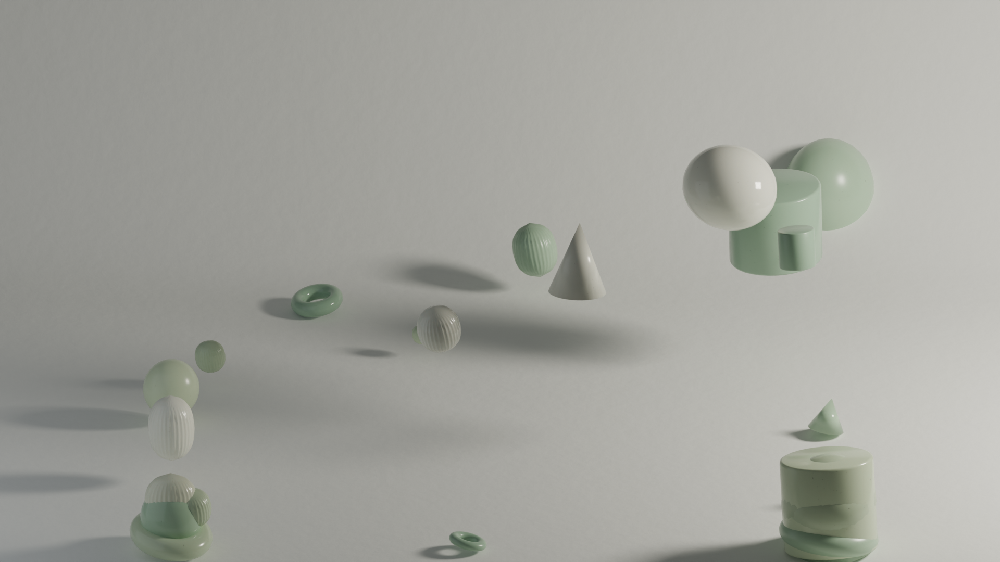

---

### Metallic Flow
This series explores the concept of kinetic paths and digital connectivity. Central to the composition are the sweeping, "flowing" metallic splines that weave through the geometric field.

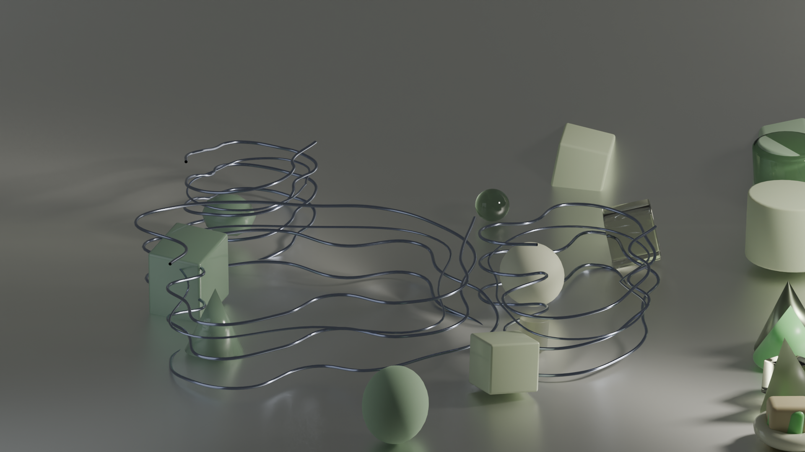

---

### HDR Lighting Model
This scene focuses on physically-based lighting, where light behaves realistically — from the brilliant glints on metallic surfaces to the soft, deep shadows of matte primitives.

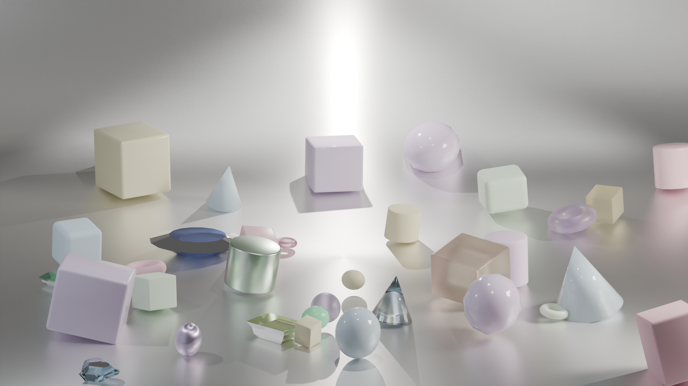

---

### Metal Plate Backdrop
A sophisticated exploration of anisotropic reflections and surface conductivity. This scene utilizes a high-gloss, deep purple metallic substrate that acts as a mirror for the surrounding geometry.

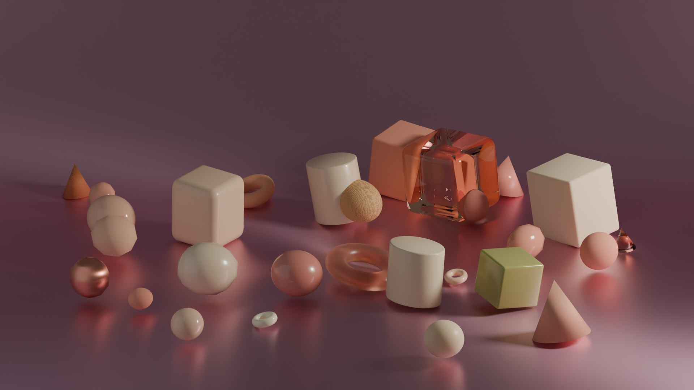

---

### Arctic Aurora
High-fidelity renders showcasing subsurface scattering, glass refraction, and metallic anisotropy across various 3D primitives.

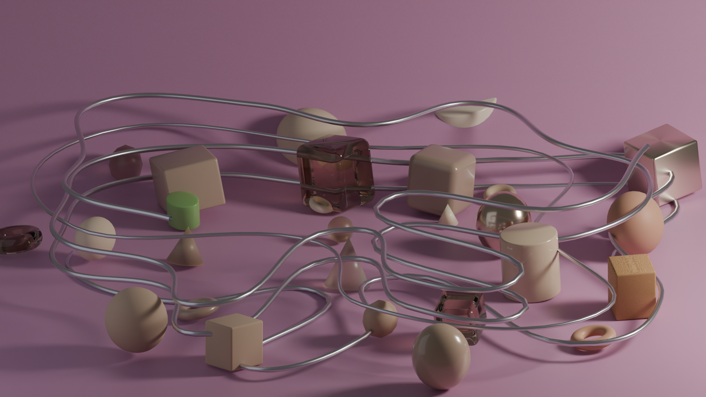

---

### Scaffolding and Gemstones
Incorporating dynamic spline paths to create a sense of movement. These scenes illustrate the flow of data or energy through a field of abstract obstacles, rendered with high-specular metallic finishes.

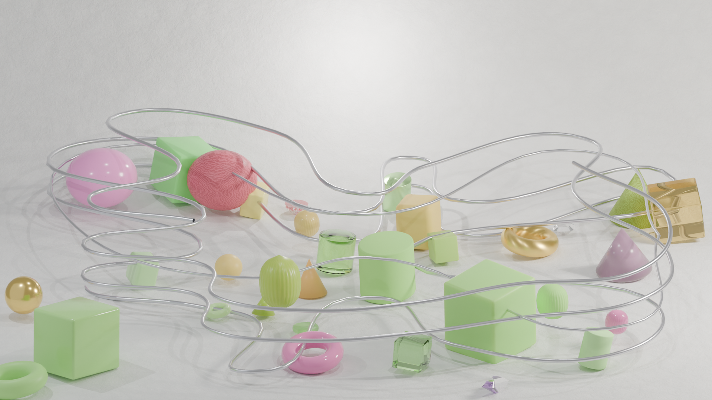

---

### Tropical Punch Color Scheme
A visual experiment that translates the sensory experience of tropical fruits and jellies into a digital abstract.

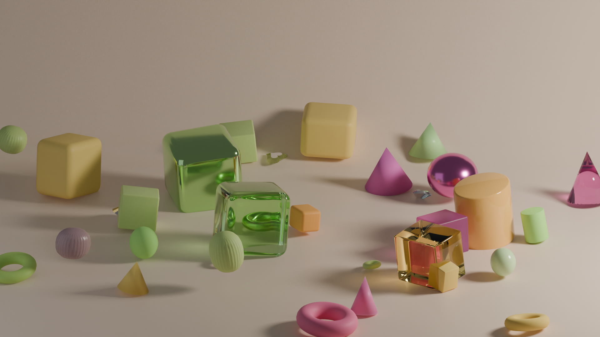

---

### Typography Scene
Build Hybrid Compositions: Integrate external geometry seamlessly into your workflow. The scene utilizes a custom model created with our free SVG Text Extruder tool — demonstrating how easily you can combine Scene Composer with outside assets.

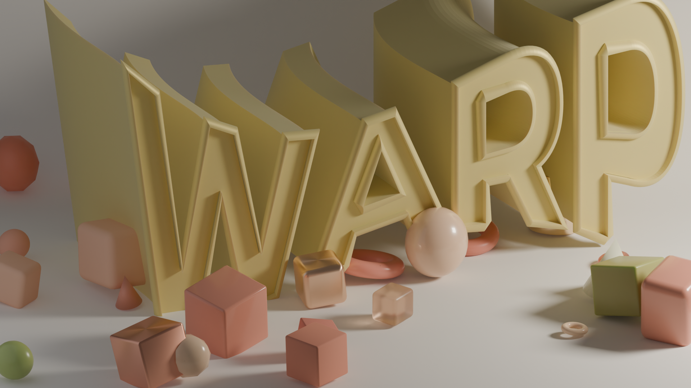

The external model used in this scene ([extruded-model.obj](extruded-model.obj)) was generated via our free [SVG Text Extruder](https://www.micre13b.com/projects/SVGTextExtruder.html) (exported as `.obj`). Upon import, simply adjust the scale to perfectly match your scene's proportions.

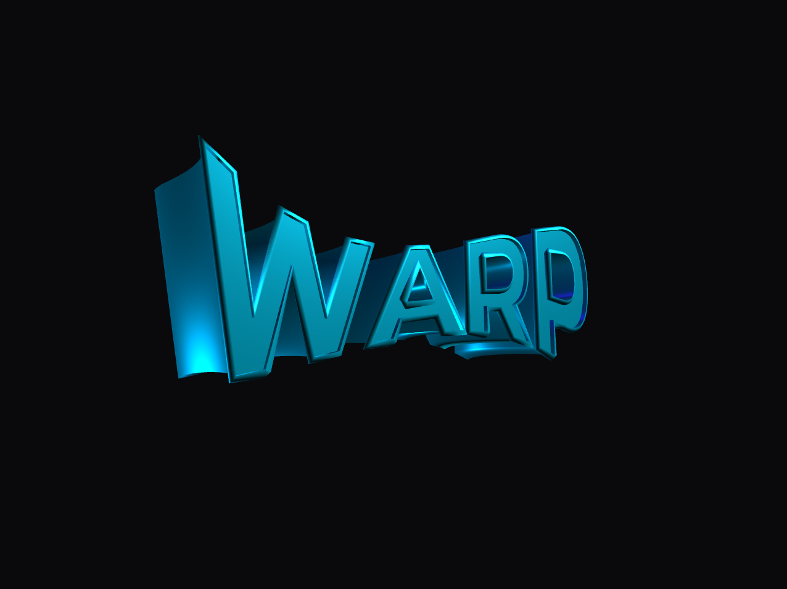

---

## License

GPL — Free to use and modify.

---

## Credits

&copy; 2026 [MICRE13B.COM](https://www.micre13b.com) — Projects powered by Claude.ai
Producer of the [MICR E13B](https://www.micre13b.com) Font.
